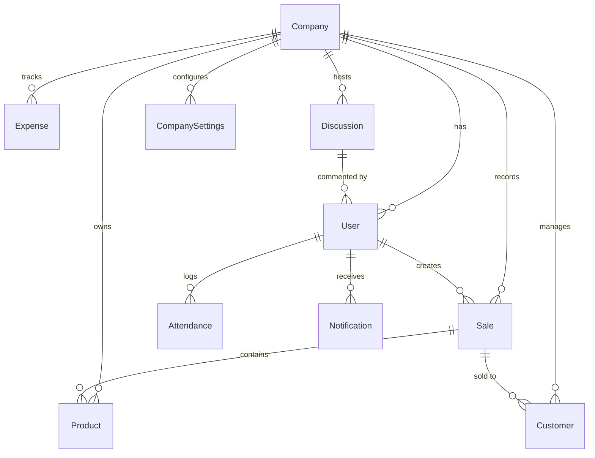

<h1 align="center">📊 Biz Smart Tracker</h1>

<p align="center">
  <strong>All-in-One Business Management Platform for SMEs</strong>
</p>

<p align="center">
  <a href="https://nodejs.org/"></a>
  <a href="https://react.dev/"></a>
  <a href="https://expressjs.com/"></a>
  <a href="https://www.mongodb.com/"></a>
  <a href="https://socket.io/"></a>
  <a href="LICENSE"></a>
</p>

<p align="center">
  A comprehensive, full-stack business management platform designed for small-to-medium enterprises (SMEs). Biz Smart Tracker unifies <strong>sales tracking, inventory management, employee attendance, expense monitoring, customer management, team discussions, and financial reporting</strong> — all in one modern, real-time dashboard with role-based access control and multi-company support.
</p>

---

## 📋 Table of Contents

- [Key Features](#-key-features)
- [System Architecture](#️-system-architecture)
- [Tech Stack](#️-tech-stack)
- [Getting Started](#-getting-started)
- [Environment Variables](#-environment-variables)
- [API Reference](#-api-reference)
- [Database Schema](#️-database-schema)
- [Security Features](#-security-features)
- [Project Structure](#-project-structure)
- [Contributing](#-contributing)
- [License](#-license)

---

## ✨ Key Features

### 📈 Sales & Revenue
- **Point of Sale (POS)** — Streamlined selling interface with product search, quantity management, and invoice generation
- **Sales History** — Complete transaction logs with date filtering, customer tagging, and export capabilities
- **Revenue Dashboard** — Interactive Chart.js visualizations with daily, weekly, and monthly breakdowns

### 📦 Inventory Management
- **Product Catalog** — Full CRUD for products with images, pricing, stock levels, and categories
- **Custom Schema Fields** — Define custom inventory attributes per company (e.g., "Color", "Warranty Period")
- **Low Stock Alerts** — Automated real-time notifications when products fall below threshold levels
- **Product Status Monitoring** — Hourly background checks for stock levels with notification dispatch

### 👥 Employee & Attendance
- **User Management** — Invite, assign roles (Admin/Manager/Employee), and manage team members
- **Attendance Tracking** — Daily check-in/check-out with timestamps, late arrivals, and absence logging
- **Attendance Reports** — Monthly and weekly attendance summaries per employee

### 💰 Expense Management
- **Expense Logger** — Categorize and record business expenses with dates and descriptions
- **Expense Analytics** — Visual breakdowns by category and time period

### 👤 Customer Management
- **Customer Database** — Store customer details, contact info, and purchase history
- **Customer Insights** — Track which customers generate the most revenue

### 💬 Discussion Board
- **Team Communication** — Create discussion threads for business topics
- **Real-Time Comments** — Socket.IO-powered live comment updates
- **Discussion Rooms** — Join/leave discussion rooms with live user tracking
- **Filters & Stats** — Filter by status, search, and view engagement statistics

### 📊 Reports & Analytics
- **Financial Reports** — Revenue vs. expenses, profit margins, and trend analysis
- **Sales Reports** — Top-selling products, sales by period, and customer-wise breakdown
- **Exportable Data** — Download reports for accounting and auditing

### 🔔 Real-Time Notifications
- **Socket.IO Events** — Instant push notifications for sales, low stock alerts, and team updates
- **Notification Center** — In-app notification panel with read/unread status and history

---

## 🏗️ System Architecture

```
┌──────────────────────────────────────────────────────────────────┐
│                     BIZ SMART TRACKER                           │
├──────────────────────────┬───────────────────────────────────────┤
│                          │                                       │
│     🖥️ Frontend          │          🖥️ Backend                   │
│     React 19 + Vite      │          Express 5 + MongoDB          │
│                          │                                       │
│  ┌─────────────────┐     │     ┌──────────────────────┐         │
│  │ Landing Page     │     │     │ Security Layer       │         │
│  │ Auth (Login/OTP) │────►│────►│ Helmet + CORS        │         │
│  │ Dashboard        │     │     │ Rate Limiting         │         │
│  │ POS / Selling    │     │     │ Mongo Sanitization    │         │
│  │ Inventory        │     │     │ JWT Auth              │         │
│  │ Customers        │     │     └──────────┬───────────┘         │
│  │ Expenses         │     │                │                     │
│  │ Reports          │     │     ┌──────────▼───────────┐         │
│  │ Discussion Board │◄───►│◄───►│ Socket.IO Server     │         │
│  │ User Management  │     │     │ (Real-time events)   │         │
│  │ Settings         │     │     └──────────┬───────────┘         │
│  │ Profile          │     │                │                     │
│  └─────────────────┘     │     ┌──────────▼───────────┐         │
│                          │     │ 13 Route Modules      │         │
│  UI Libraries:           │     │ 12 Controllers        │         │
│  • Chart.js / chartjs-2  │     │ 14 Mongoose Models    │         │
│  • React Router v7       │     │ Passport.js OAuth     │         │
│  • Axios                 │     └──────────┬───────────┘         │
│  • date-fns              │                │                     │
│  • file-saver            │     ┌──────────▼───────────┐         │
│                          │     │ MongoDB Atlas         │         │
│                          │     │ (Multi-tenant data)   │         │
│                          │     └──────────────────────┘         │
├──────────────────────────┴───────────────────────────────────────┤
│              Deployment: Vercel (Client) + Render (Backend)      │
└──────────────────────────────────────────────────────────────────┘
```

---

## 🛠️ Tech Stack

### Frontend
| Technology | Version | Purpose |
|-----------|---------|---------|
| React | 19 | UI framework |
| Vite | Latest | Build tool & dev server |
| React Router | v7 | Client-side routing |
| Chart.js + react-chartjs-2 | 4.x | Interactive charts & analytics |
| Axios | Latest | HTTP client for API calls |
| date-fns | 4.x | Date formatting & manipulation |
| file-saver | 2.x | Export reports as downloadable files |
| Socket.IO Client | 4.x | Real-time event handling |

### Backend
| Technology | Version | Purpose |
|-----------|---------|---------|
| Node.js | 18+ | Runtime environment |
| Express | 5 | Web framework |
| Mongoose | 8.x | MongoDB ODM |
| Socket.IO | 4.8 | WebSocket server for real-time features |
| JWT (jsonwebtoken) | 9.x | Token-based authentication |
| Passport.js | 0.7 | Google & Facebook OAuth strategies |
| bcrypt | 5.x | Password hashing |
| Helmet | 8.x | HTTP security headers |
| compression | 1.x | Response compression (70-90% size reduction) |
| express-rate-limit | 8.x | Brute-force protection on auth routes |
| Joi | 18.x | Request body validation |
| Nodemailer + Resend | Latest | Email service (OTP, notifications) |

### Database
| Technology | Purpose |
|-----------|---------|
| MongoDB Atlas | Cloud-hosted NoSQL database |
| 14 Collections | Company, User, Product, Sale, Expense, Attendance, Customer, Discussion, Notification, AuditLog, CompanyField, CompanySettings, InventoryField, DeletedDefaultField |

## 🔌 API Reference

> **Legend:** 🔓 = Public (no login needed) · 🔒 = Protected (JWT token required)

### Authentication (`/api/auth`)
| Method | Endpoint | Description | Auth |
|--------|----------|-------------|------|
| POST | `/login` | Email + password login | 🔓 Public |
| POST | `/signup` | Register new user | 🔓 Public |
| POST | `/google` | Google OAuth login | 🔓 Public |
| POST | `/facebook` | Facebook OAuth login | 🔓 Public |
| POST | `/complete-signup` | Complete social signup | 🔓 Public |
| POST | `/send-otp` | Send OTP to email | 🔓 Public |
| POST | `/verify-otp` | Verify email OTP | 🔓 Public |
| POST | `/forgot-password` | Send password reset OTP | 🔓 Public |
| POST | `/reset-password` | Reset password with OTP | 🔓 Public |

### Products (`/api/products`)
| Method | Endpoint | Description | Auth |
|--------|----------|-------------|------|
| GET | `/` | List all products | 🔒 Protected |
| POST | `/` | Create a product | 🔒 Protected |
| PUT | `/:id` | Update a product | 🔒 Protected |
| DELETE | `/:id` | Delete a product | 🔒 Protected |

### Sales (`/api/sales`)
| Method | Endpoint | Description | Auth |
|--------|----------|-------------|------|
| GET | `/` | List all sales | 🔒 Protected |
| POST | `/` | Record a new sale | 🔒 Protected |
| GET | `/:id` | Get sale details | 🔒 Protected |

### Customers (`/api/customers`)
| Method | Endpoint | Description | Auth |
|--------|----------|-------------|------|
| GET | `/` | List all customers | 🔒 Protected |
| POST | `/` | Add a customer | 🔒 Protected |
| PUT | `/:id` | Update customer info | 🔒 Protected |
| DELETE | `/:id` | Remove a customer | 🔒 Protected |

### Expenses (`/api/expenses`)
| Method | Endpoint | Description | Auth |
|--------|----------|-------------|------|
| GET | `/` | List all expenses | 🔒 Protected |
| POST | `/` | Log an expense | 🔒 Protected |
| DELETE | `/:id` | Delete an expense | 🔒 Protected |

### Reports (`/api/reports`)
| Method | Endpoint | Description | Auth |
|--------|----------|-------------|------|
| GET | `/sales` | Sales report with filters | 🔒 Protected |
| GET | `/expenses` | Expense report | 🔒 Protected |
| GET | `/dashboard` | Dashboard summary stats | 🔒 Protected |

### Discussions (`/api/discussions`)
| Method | Endpoint | Description | Auth |
|--------|----------|-------------|------|
| GET | `/` | List discussions | 🔒 Protected |
| POST | `/` | Create a discussion | 🔒 Protected |
| GET | `/:id` | Get discussion + comments | 🔒 Protected |
| POST | `/:id/comment` | Add comment (real-time) | 🔒 Protected |

### Other Endpoints
| Module | Base Path | Endpoints |
|--------|-----------|-----------|
| Users | `/api/user` | CRUD, role management, attendance |
| Notifications | `/api/notifications` | List, mark read, product status |
| Inventory Fields | `/api/inventory` | Custom field schema management |
| Settings | `/api/settings` | Company settings configuration |

---

## 🗄️ Database Schema



### Key Models

| Model | Fields | Purpose |
|-------|--------|---------|
| `Company` | name, industry, logo, plan | Multi-tenant organization |
| `User` | email, password, role, company | Team member with RBAC |
| `Product` | name, price, stock, category, customFields | Inventory item |
| `Sale` | products, total, customer, date, createdBy | Transaction record |
| `Expense` | category, amount, description, date | Business expense |
| `Attendance` | user, date, checkIn, checkOut, status | Daily attendance |
| `Customer` | name, email, phone, totalPurchases | Client record |
| `Discussion` | title, content, author, comments | Team thread |
| `Notification` | type, message, user, read | System alert |
| `AuditLog` | action, user, details, timestamp | Activity audit trail |

---

## 🔒 Security Features

| Feature | Implementation | Protection Against |
|---------|---------------|-------------------|
| **Helmet** | HTTP security headers | XSS, clickjacking, MIME sniffing |
| **CORS** | Origin-restricted API access | Cross-origin attacks |
| **Rate Limiting** | 15 req/15min on auth endpoints | Brute-force login attacks |
| **MongoDB Sanitization** | Custom `$` and `.` key stripping | NoSQL injection |
| **bcrypt** | 10-round password hashing | Password theft |
| **JWT** | Token-based stateless auth | Session hijacking |
| **Joi Validation** | Request body schema validation | Malformed input |
| **Compression** | gzip response compression | Bandwidth optimization |
| **Passport.js** | OAuth 2.0 (Google, Facebook) | Secure social login |

---

## 📐 Project Structure

```
Biz-Smart-Tracker-System/
├── Backend/
│   ├── config/
│   │   ├── db.js                    # MongoDB connection
│   │   └── passport.js              # Google & Facebook OAuth config
│   ├── controller/
│   │   ├── authController.js        # Login, signup, OTP, OAuth
│   │   ├── productController.js     # Product CRUD
│   │   ├── saleController.js        # Sales recording & history
│   │   ├── customerController.js    # Customer management
│   │   ├── expenseController.js     # Expense logging
│   │   ├── attendanceController.js  # Check-in/out tracking
│   │   ├── reportController.js      # Report generation
│   │   ├── discussionController.js  # Discussion board logic
│   │   ├── notificationController.js # Real-time notifications
│   │   ├── settingsController.js    # Company configuration
│   │   ├── inventoryFieldController.js # Custom field schemas
│   │   └── userController.js        # User & role management
│   ├── middleware/
│   │   ├── authMiddleware.js        # JWT verification guard
│   │   ├── csrf.js                  # CSRF protection
│   │   └── validation.js            # Joi request validation
│   ├── models/                      # 14 Mongoose schemas
│   ├── routes/                      # 13 Express route modules
│   ├── server.js                    # Express + Socket.IO entry point
│   ├── env.example                  # Environment template
│   └── package.json
│
├── Client/
│   ├── components/                  # Reusable UI (Button, Toast, Select, etc.)
│   │   └── auth/                    # GoogleLogin, ProtectedRoute
│   ├── context/                     # CurrencyContext provider
│   ├── pages/
│   │   ├── auth/                    # Login, SignUp, OTP, Password Reset
│   │   ├── dashboard/               # Dashboard analytics & reports
│   │   ├── inventory/               # Product, Schema, Selling pages
│   │   ├── customer/                # Customer management
│   │   ├── expenses/                # Expense logger
│   │   ├── discussion/              # Discussion board with components
│   │   ├── invoice/                 # Invoice generation & preview
│   │   ├── landing/                 # Public landing page
│   │   ├── settings/                # Company settings
│   │   └── user/                    # Profile, User management, Attendance
│   ├── index.html
│   ├── vercel.json                  # Vercel deployment config
│   └── package.json
│
└── README.md
```

---

## 🤝 Contributing

Contributions are welcome! To get started:

1. **Fork** the repository
2. **Create** a feature branch (`git checkout -b feature/amazing-feature`)
3. **Commit** your changes (`git commit -m 'feat: add amazing feature'`)
4. **Push** to the branch (`git push origin feature/amazing-feature`)
5. **Open** a Pull Request

---

## 📄 License

This project is licensed under the MIT License — see the [LICENSE](LICENSE) file for details.
